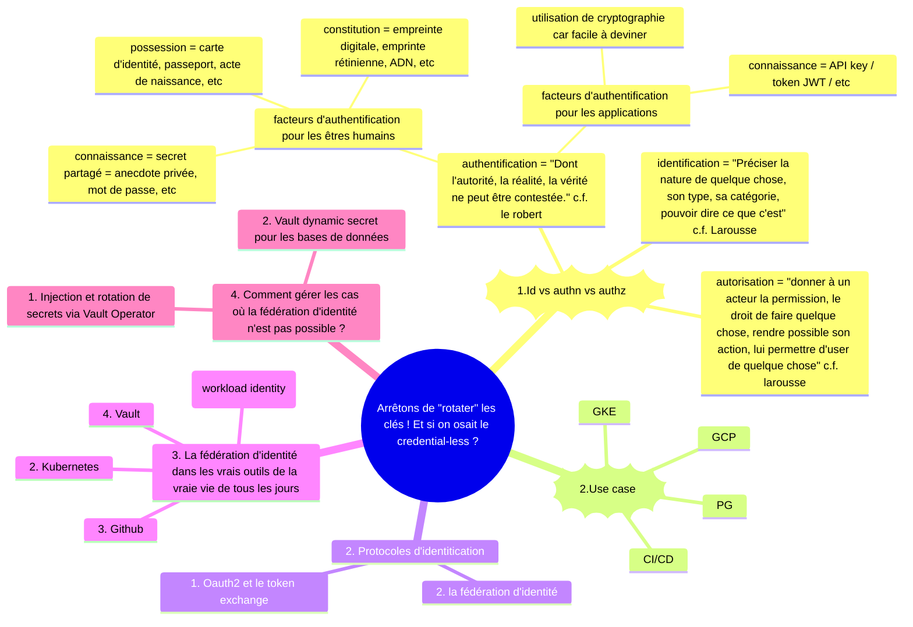
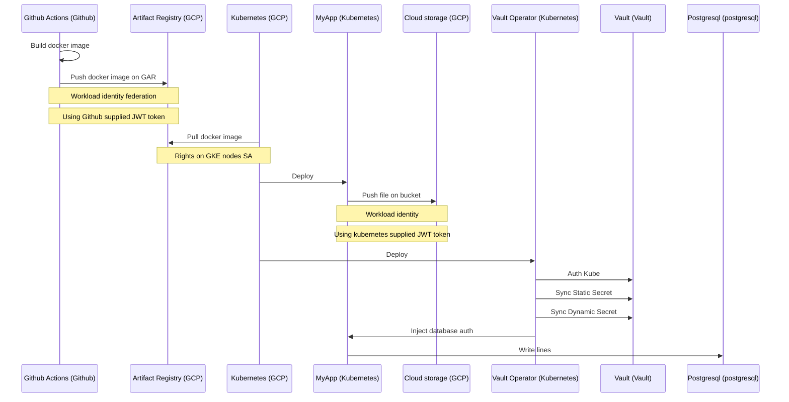

-----------------------
------- USECASE -------
-----------------------

Credential Github -> GCP (GAR) => Workload identity federation
GKE -> pull image docker from gar (authz sa node)
POD => Bucket => Workload identity

Vault:
Auth Kubernetes => Token exchange
Secret statique
Secret dynamique Postgresql

# Contents

0. Le fil rouge (la démo)
1. Authz vs Autn  (@Louis)
2. Oauth2 & TokenExchange (@Louis)
3. Application Google Cloud (ou autre csp)
   4. Workload identity Federation  (@Gaetan)
      5. Démo Github / Google (@Gaetan)
   6.  Workload identity (GKE) (@Gaetan)
      7. Démo GKE/ GCS (@Gaetan)
8. .....
   9. Vault (@Alex)
      10. Injection et rotation de secrets via Vault Operator
      11. Demo Vault dynamic secret pour les bases de données
