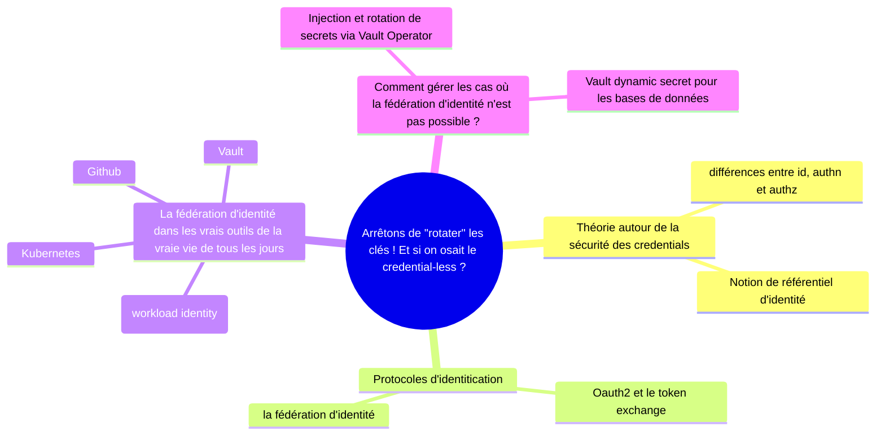

```mermaid
mindmap
  root((Arrêtons de "rotater" les clés ! Et si on osait le credential-less ?))
    Théorie autour de la sécurité des credentials
      différences entre id, authn et authz
      Notion de référentiel d'identité
    Protocoles d'identitication
      Oauth2 et le token exchange
      la fédération d'identité
    La fédération d'identité dans les vrais outils de la vraie vie de tous les jours
      GCP (workload identity)
      Kubernetes
      Github
      Vault
    Comment gérer les cas où la fédération d'identité n'est pas possible ?
      Injection et rotation de secrets via Vault Operator
      Vault dynamic secret pour les bases de données
```
