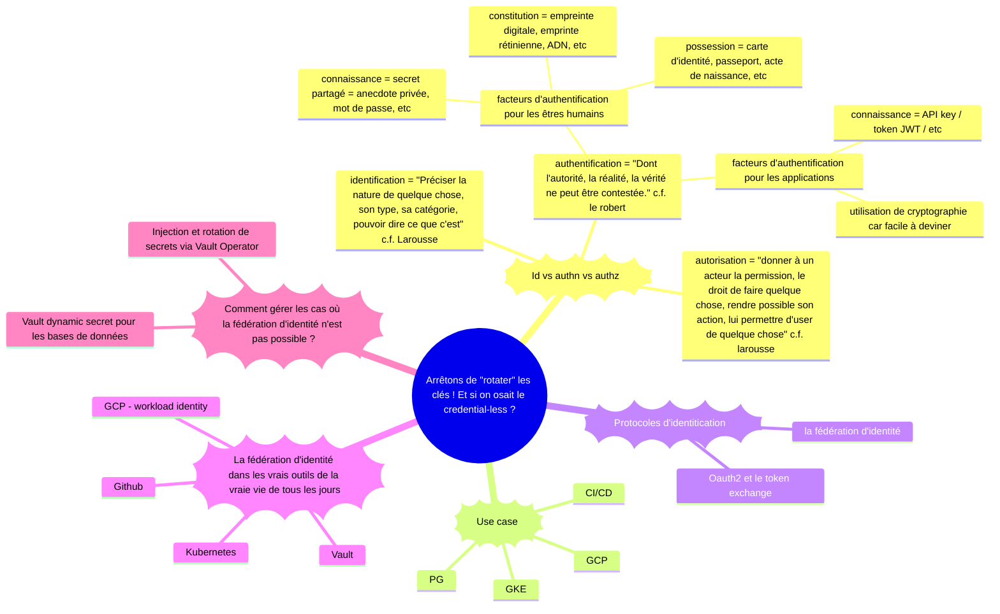
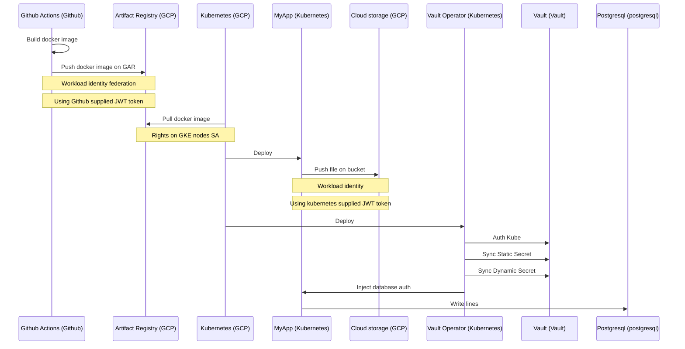

-----------------------
------- USECASE -------
-----------------------

- Credential Github -> GCP (GAR) => Workload identity federation
- GKE -> pull image docker from gar (authz sa node)
- POD => Bucket => Workload identity

Vault:
- Auth Kubernetes => Token exchange
- Secret statique
- Secret dynamique Postgresql

# Contents

0. Le fil rouge (la démo)
1. Authz vs Autn  (@Alex)
2. Oauth2 & TokenExchange (@Alex)
3. Application Google Cloud (ou autre csp)
    1. Workload identity Federation  (@Gaetan)
        1. Démo Github / Google (@Gaetan)
    2. Workload identity (GKE) (@Gaetan)
        1. Démo GKE/ GCS (@Gaetan)
4. .....
    1. Vault (@Alex)
        1. Injection et rotation de secrets via Vault Operator
        2. Demo Vault dynamic secret pour les bases de données
