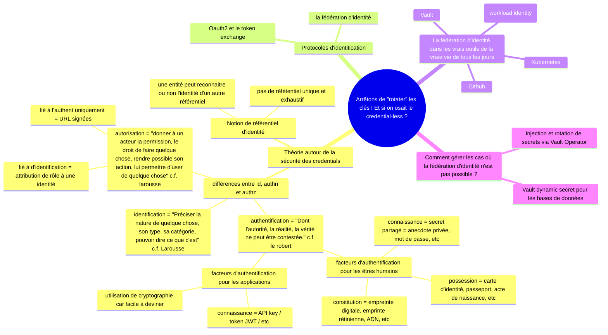

```mermaid
mindmap
  root((Arrêtons de "rotater" les clés ! Et si on osait le credential-less ?))
    Théorie autour de la sécurité des credentials
      différences entre id, authn et authz
        identification = "Préciser la nature de quelque chose, son type, sa catégorie, pouvoir dire ce que c'est" c.f. Larousse
        authentification = "Dont l'autorité, la réalité, la vérité ne peut être contestée." c.f. le robert
            facteurs d'authentification pour les êtres humains
                connaissance = secret partagé = anecdote privée, mot de passe, etc
                possession = carte d'identité, passeport, acte de naissance, etc
                constitution = empreinte digitale, emprinte rétinienne, ADN, etc
            facteurs d'authentification pour les applications
                connaissance = API key / token JWT / etc 
                utilisation de cryptographie car facile à deviner
        autorisation = "donner à un acteur la permission, le droit de faire quelque chose, rendre possible son action, lui permettre d'user de quelque chose" c.f. larousse
            lié à d'identification = attribution de rôle à une identité
            lié à l'authent uniquement = URL signées
      Notion de référentiel d'identité
        pas de réfétentiel unique et exhaustif
        une entité peut reconnaitre ou non l'identité d'un autre référentiel
    Protocoles d'identitication
      Oauth2 et le token exchange
      la fédération d'identité
    La fédération d'identité dans les vrais outils de la vraie vie de tous les jours
      GCP (workload identity)
      Kubernetes
      Github
      Vault
    Comment gérer les cas où la fédération d'identité n'est pas possible ?
      Injection et rotation de secrets via Vault Operator
      Vault dynamic secret pour les bases de données
```
